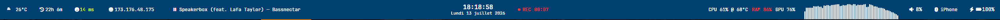
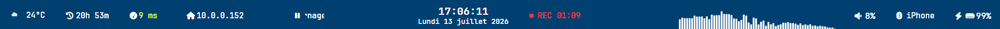

<div align="center">

# BuffMyBar

### A native Windows desktop bar inspired by the flexibility of Linux desktops.

Lightweight • Native WPF • Multi-monitor • Windows 11 Integration • Open Source


---



</div>

---

# What is BuffMyBar?

BuffMyBar is a **native Windows desktop bar** designed for users who love the flexibility of Linux desktop environments while keeping the performance and compatibility of Windows.

It is **not a Waybar clone**.

Instead, BuffMyBar follows the same philosophy:

- Native performance
- Minimal memory usage
- Beautiful animations
- Follows the Windows look
- Windows-first integration

Everything is built using native WPF and Windows APIs.

No Electron.

No Chromium.

No web technologies.

---

# Features

## Desktop

- Native Windows 11 desktop bar, one per monitor
- Multi-monitor support with automatic monitor detection
- Automatic per-monitor DPI awareness
- **Taskbar-like reserved space**: windows never maximize under the bar
  (self-heals, and re-registers when Explorer restarts)
- Fullscreen-app friendly (reclaims its space, pauses the visualizer during games)

---

## Widgets

- **Clock & calendar** — time + date, with a hover calendar flyout and optional
  Google Calendar events
- **Weather** — official Environment Canada data (no API key), with **native
  animated icons** and a detailed hover flyout (feels-like, humidity, wind, 3-day forecast)
- **Audio visualizer** — WASAPI loopback spectrum
- **System monitor** — CPU / RAM / GPU / CPU temperature indicators, with a
  hover flyout showing live meters
- **Network** — local / public IP, optional latency (game mode)
- **Media** — now-playing via Windows media controls (play/pause, next/previous)
- **Bluetooth** — connected device + battery
- **Battery**
- **Volume**
- **Uptime**
- **OBS integration** — recording/streaming status via obs-websocket

---

## Windows Integration

- Follows the Windows 11 theme automatically (light / dark + accent color)
- Acrylic / Mica backdrop
- Dynamic monitor detection (survives sleep, resolution and display changes)
- Optional update check against GitHub Releases

---

## Visuals

- Native WPF animations
- Buff glitch text animation
- Animated weather icons (native shapes, day/night aware)
- Smooth fades
- Modern hover flyouts (calendar, weather, system monitor)

---

## Under the hood

- A single shared **widget scheduler** drives all polling widgets from one tick
- The audio visualizer idles at ~5 FPS on silence and stops rendering during
  fullscreen apps
- Diagnostic logging is opt-in (`BUFFBAR_VERBOSE=1`) — no disk writes in normal use
- Zero runtime dependencies beyond .NET 8 (LibreHardwareMonitor is used only for
  the optional CPU temperature)

---

# Why BuffMyBar?

Linux users have access to incredible desktop bars such as:

- Waybar
- Polybar
- KDE Panels

Windows deserves the same level of customization.

BuffMyBar aims to become that desktop bar.

Not by copying Linux…

…but by embracing native Windows technologies.

---

# Philosophy

BuffMyBar follows five principles:

- Native first
- Lightweight
- Beautiful
- Fast
- Open Source

Every feature should respect these principles.

---

# Installation

## Download

Download the latest release from GitHub:

https://github.com/ineedabuff/BuffMyBar-W26/releases

Once published to winget, it will also be installable with:

```powershell
winget install IneedABUFF.BuffMyBar
```

---

## Build from source

```powershell
git clone https://github.com/ineedabuff/BuffMyBar-W26.git

cd BuffMyBar-W26

dotnet build

dotnet run --project BuffBar
```

---

# Configuration

Right-click the bar → **Paramètres…**, or edit
`%AppData%\BuffMyBar-W26\settings.json` directly.

- **Widget toggles apply live** — enabling/disabling a widget recomposes the bar
  in place, without a restart or a position reload.
- Choose where the system indicators appear: **external**, **primary**, or **all** monitors.
- Set the weather city (any Environment Canada city name, e.g. `Mascouche`).
- OBS (obs-websocket) host / port / password.
- Google Calendar (optional): OAuth "Desktop" client id / secret; tokens are
  stored separately and never in `settings.json`.

---

# Architecture

BuffMyBar is built around independent services.

```text
┌─────────────────────────────────────────────┐
│                 BuffMyBar                   │
├─────────────────────────────────────────────┤
│                  Widgets                    │
│ Clock │ Weather │ System │ Media │ Network… │
├─────────────────────────────────────────────┤
│             Widget Scheduler                │
│         one shared tick for polling         │
├─────────────────────────────────────────────┤
│           Animation Framework               │
│  Glitch │ Fade │ Animated weather icons     │
├─────────────────────────────────────────────┤
│           Windows Theme Sync                │
│    Light / Dark │ Accent │ Auto-follow      │
├─────────────────────────────────────────────┤
│         AppBar (reserved space)             │
├─────────────────────────────────────────────┤
│         Windows 11 / WPF / .NET 8           │
└─────────────────────────────────────────────┘
```

This architecture keeps widgets simple while allowing the framework to evolve independently.

---

# Gallery

## BuffMyBar with all options ON


---

## Windows Theme Synchronization



---

## Audio Visualizer


---

## OBS Integration


---

# Roadmap

## Shipped

- Native Windows 11 theme synchronization (light / dark + accent)
- Taskbar-like reserved space (self-healing) and live settings (no restart)
- Unified widget scheduler
- Environment Canada weather + native animated icons
- System monitor widget and flyout
- Hover flyout framework (calendar, weather, system)
- Audio visualizer idle throttling + fullscreen pause
- Update check + winget manifest

## Planned

- Winget distribution (manifest is ready to submit)
- Full auto-update (download + install)
- Windows toast notifications
- Plugin API
- Workspace support

---

# Performance Goals

BuffMyBar is designed to remain lightweight.

Target specifications:

| Resource | Goal |
|-----------|------|
| RAM | < 80 MB |
| CPU (Idle) | < 0.5 % |
| GPU | Minimal |
| Startup | < 1 second |

The shared scheduler and the visualizer's idle throttling exist to keep the
idle CPU target realistic. Measure with `Docs/Engineering/measure-idle.ps1`.

---

# Contributing

Contributions are welcome.

Before opening a Pull Request:

- Follow the coding style.
- Keep widgets independent.
- Avoid unnecessary dependencies.
- Prefer native Windows APIs.
- Keep memory usage low.

See:

```
CONTRIBUTING.md
```

---

# Bug Reports

Please include:

- Windows version
- BuffMyBar version
- Screenshots
- Logs (set `BUFFBAR_VERBOSE=1` for detailed logs)
- Reproduction steps

GitHub Issues are the preferred way to report bugs.

---

# FAQ

## Is BuffMyBar a Waybar port?

No.

BuffMyBar is a native Windows application inspired by the flexibility of Linux desktop environments.

---

## Does BuffMyBar use Electron?

No.

Everything is written in native WPF using .NET 8.

---

## Does BuffMyBar replace the Windows taskbar?

No.

It runs alongside the taskbar and reserves its own space the same way the taskbar
does, so maximized windows never cover it.

---

## Does BuffMyBar support multiple monitors?

Yes.

Each monitor gets its own bar, and they all follow the Windows theme.

---

## Where does the weather come from?

From Environment and Climate Change Canada's free, official citypage feed — no API
key required. Set your city in the settings.

---

## Will Windows updates break BuffMyBar?

The goal is to rely on documented Windows APIs to minimize compatibility issues.

---

# License

BuffMyBar is released under the WTFPL License.

See:

```
LICENSE
```

---

# Acknowledgements

Special thanks to the Linux desktop community for years of inspiration.

Projects that influenced BuffMyBar include:

- KDE Plasma
- Waybar
- Polybar
- YASB
- Cava

BuffMyBar is not a clone of these projects.

It is a Windows-native implementation inspired by the same philosophy.

---

<div align="center">

Made with ❤️ in Québec 🇨🇦

**BuffMyBar — The desktop bar Windows should have shipped with.**

</div>
